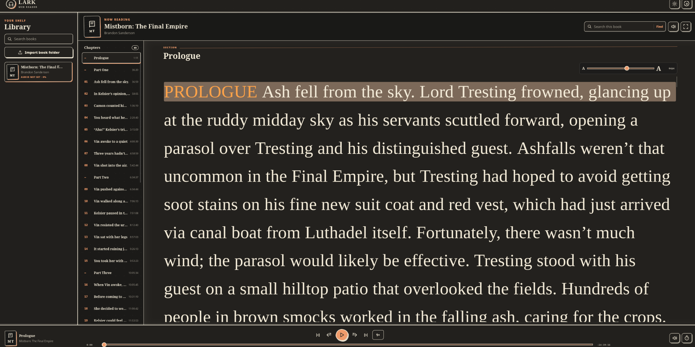
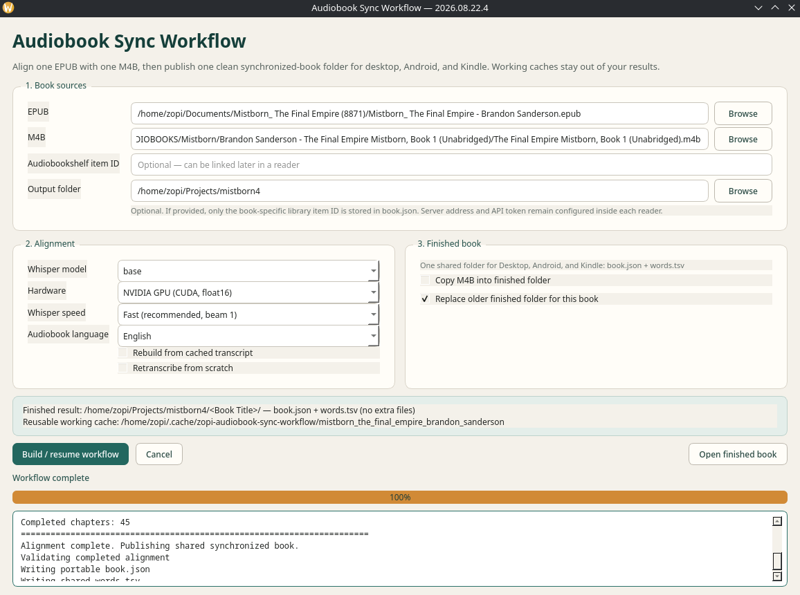
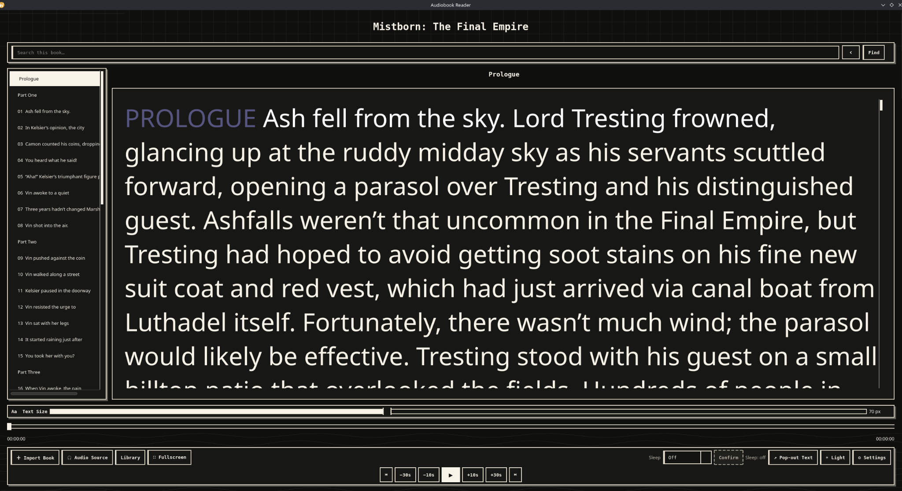

<div align="center">

# Audiobooks Readers

**Create synchronized audiobook text once, then read and listen across Linux, Windows, Web, Android, and Kindle.**

`Synchronized text` · `Local M4B` · `Audiobookshelf` · `Cross-device reading`

</div>

## Included apps

| App | Platform | Purpose |
| --- | --- | --- |
| [Audiobook Workflow](docs/AUDIOBOOK-WORKFLOW.md) | Linux / Windows | Build synchronized `book.json + words.tsv` books from an EPUB and matching M4B |
| [Desktop Reader](docs/DESKTOP-READER.md) | Linux / Windows | Native synchronized reading, local/ABS audio, themes, fullscreen and pop-out text |
| [LARK Web Reader](docs/WEB-READER.md) | Web | Shared browser library for computers and phones |
| [Android Reader](docs/ANDROID-READER.md) | Android | Native mobile synchronized reader with background playback |
| [LARK Sync](docs/LARK-SYNC-KINDLE.md) | Kindle | E-Ink audiobook player and synchronized reader |

## Downloads

Grab the latest builds from the **GitHub Releases** page:

- Audiobook Workflow — Linux / Windows
- Desktop Audiobook Reader — Linux / Windows
- LARK Web Reader — Linux / Windows
- AudiobookSync Reader — Android APK
- LARK Sync — Kindle ZIP

---

## 1. Create a synchronized book

Install **Python 3.11+** and **FFmpeg**, then extract the Audiobook Workflow package.

Linux:

```bash
./setup.sh
./run.sh
```

Windows:

```text
setup_windows.bat
run_windows.bat
```

In the app:

1. Select the EPUB.
2. Select the matching M4B.
3. Choose CPU or NVIDIA GPU transcription.
4. Start the workflow.
5. Keep the generated book folder containing `book.json` and `words.tsv`.

CPU works but is much slower. NVIDIA mode requires the CUDA libraries described inside the workflow package.

## 2. Choose a reader

### Desktop Reader — Linux or Windows

Extract the correct package.

```text
Linux:   install the listed GTK/Qt dependencies, then python3 main.py
Windows: setup_windows.bat, then run_windows.bat
```

Choose **Import Book**, select the folder containing `book.json` and `words.tsv`, choose a local M4B or Audiobookshelf, and press Play.

### LARK Web Reader — phones and computers

Requires **Node.js 22.13+**. Extract the package on one computer that will remain the host.

```text
Linux:   bash run-local.sh
Windows: run-local.cmd
```

Open `http://localhost:4173/` on the host. From another Tailscale-connected device, open:

```text
http://HOST_TAILSCALE_IP:4173/
```

Books, progress, and Audiobookshelf links are shared through the host's `.lark-data` folder. Local audio selected in a browser stays in that browser; use Audiobookshelf when every device needs the same audio.

### Android Reader

Download `audiobooksync-reader-android.apk` from the GitHub Releases page and install it on the phone. Allow installation from that source if Android asks.

Import the synchronized book folder, then choose a matching local M4B or Audiobookshelf as the audio source.

### LARK Sync — Kindle

Requires a compatible jailbroken/native-enabled Kindle with Bluetooth audio.

Download `lark-sync-kindle.zip` from the GitHub Releases page, extract it, then:

1. Copy `LARK-Sync/` to the Kindle root so it becomes `/mnt/us/LARK-Sync/`.
2. Copy the supplied Scriptlet `.sh` files from `documents/` to `/mnt/us/documents/`.
3. Put synchronized book folders under `/mnt/us/SyncBooks/`.
4. Optional local M4B files can go under `/mnt/us/Audiobooks/`.
5. Launch **LARK Sync Reader**.

Do not use the old `.ksr` format for new books; Kindle uses the same `book.json + words.tsv` folders as the other readers.

## Audiobookshelf

Audiobookshelf is optional, but it provides streaming and cross-device listening progress. A single continuous audio track, preferably M4B, is recommended.

1. In Audiobookshelf open **Settings → Users → API Keys** and create a key.
2. In each reader enter the server address and token, then test the connection.
3. Link each synchronized book to the matching Audiobookshelf item.

For LARK Web Reader, use its built-in proxy:

```text
Host browser:   http://localhost:4173/abs
Other devices:  http://HOST_TAILSCALE_IP:4173/abs
```

For Kindle over the supplied Tailscale setup, edit `/mnt/us/LARK-Sync/audiobookshelf.conf`:

```ini
enabled=true
server=http://AUDIOBOOKSHELF_TAILSCALE_IP:13378
token=YOUR_API_KEY
proxy=http://127.0.0.1:1055
```

Never publish your real configuration or API token.

## Tested environments

- Linux: CachyOS, KDE Plasma, Wayland
- Windows: Windows 10
- Android
- Kindle Paperwhite 4, firmware 5.18.1.1.1

## Important notes

- Each package contains its own detailed README.
- LARK Sync is based on LARKPlayer and retains its GPL-3.0-or-later requirements; see each package for its applicable license.

---

## Screenshots

### LARK Web Reader



### Audiobook Sync Workflow



### Desktop Audiobook Reader



## Kindle Demo

See LARK Sync running on a Kindle:

[Watch the Kindle demo on YouTube](https://youtube.com/shorts/bub_jgZaj-8?feature=share)
